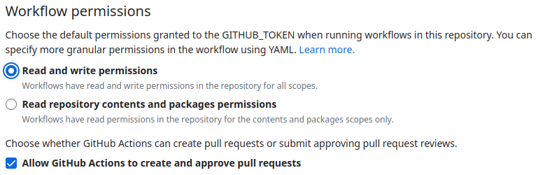
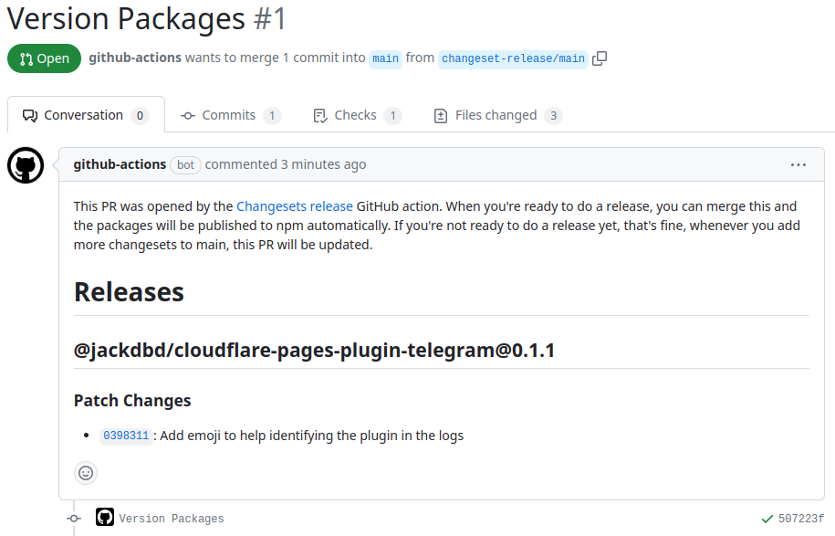

# vampa 🔥


Monorepo I use for my [Cloudflare Pages Functions](https://developers.cloudflare.com/pages/platform/functions/) plugins and [Hono](https://github.com/honojs) middlewares.

## Installation

Clone the repo:

```sh
git clone git@github.com:jackdbd/vampa.git

cd vampa
```

Install all dependencies from npmjs.com:

```sh
npm install
```

## Development

This monorepo uses [Turborepo](https://turbo.build/repo) for local development.

```sh
npm run dev
```

## Build

Build all packages in this monorepo:

```sh
npm run build
```

Generate a file size report for each library:

```sh
npm run size
```

## Release

This monorepo uses [changesets](https://github.com/changesets/changesets) to manage CHANGELOGs and releases on npmjs.com.

When you want to include a change in the CHANGELOG of one or more packages, do the following.

1: Run this command from the monorepo root:

```sh
npx changeset add
```

2: Select which packages are affected by this change, and whether this change causes a major/minor/patch version bump.

3: Double check the generated markdown file in the [.changeset](./.changeset/README.md) folder. This file will be consumed by changesets when generiting the next release. You can also double check whether changesets will trigger a major/minor/patch version bump using this command:

```sh
npx changeset status
```

4: Commit your changes and push them to the remote repository. The [Changesets Release Action](https://github.com/changesets/action) will create a Pull Request.

⚠️ In order to work, Changesets Release Action requires that the `GITHUB_TOKEN` has **Read and write permissions** and can create a Pull Request. To set the permissions of the default `GITHUB_TOKEN` used in the workflows of this GitHub repo, go to `Settings` → `Actions` → `General` → `Workflow permissions`.



5: Once Changesets Release Action has created a Pull Request, you can review it and merge it. Only when you merge this PR, Changesets will publish the packages to npmjs.com.


